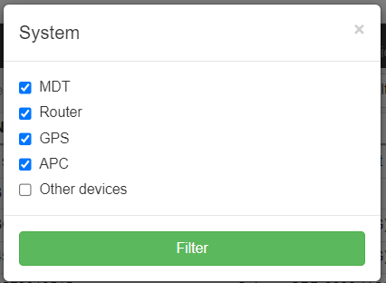
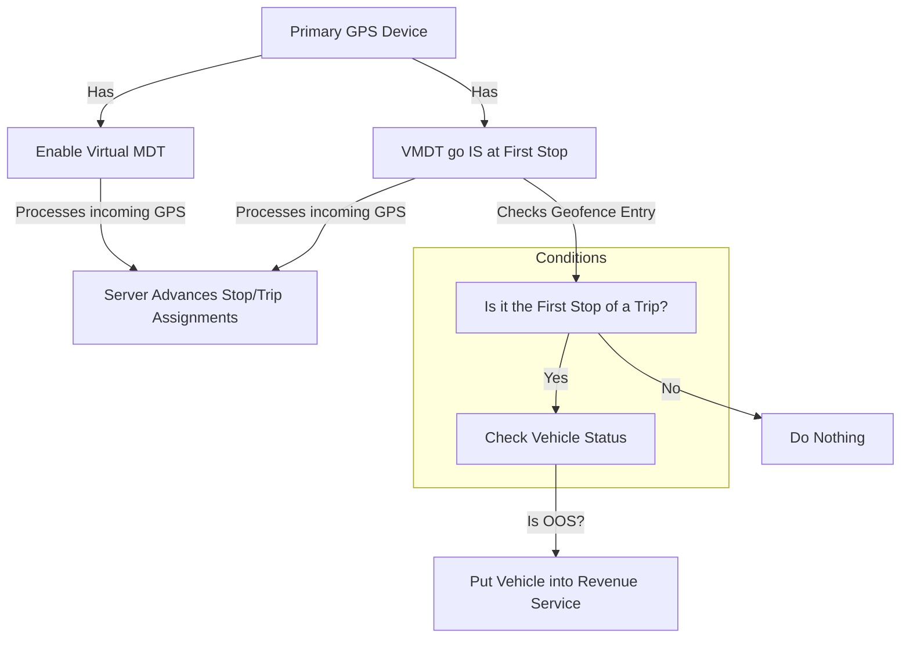

# Devices

## Definition
Devices are hardware components installed or used in a vehicle or for the operation of the Passio Software. Devices are either manually added through Config > Devices page, automatically added by an MDT signing into the account, or automatically added by Installers through the Passio One app.

Devices are grouped into 5 categories: MDT, Router, GPS, APC, or other

## How they are used in Passio

> _The ability for you to read or write different pages and action buttons is based on the solutions purchased and the user level permission assigned._

The Devices tab list all known devices associated with this account. They are grouped into multiple types of devices depending on their function. By default, the following devices are selected: MDT, Router, GPS, APC. However, your last selected setting is saved as a browser page cookie and will be saved for the next time that you open up this page. 

Action buttons

Using the filter button at the top, you can select or deselect groups of devices to display.

Other action buttons allow a user to:
 - download the device list in a .csv format
 - Wrench icon to move and show/hide column data
 - Gears icon for page settings - normally only accessible to the Passio Admin
 - Show archived button to see archived device
 - Search bar to filter what is seen

**On the device listing, the lightning bolt allows a user to perform specific actions to certain devices.**
### **The lightning bolt** for the **Calamp** has the following actions:
 - PULS data - this syncs Passio navigator with the Calamp cloud server
 - SMS commands - this allows sending SMS commands to perform actions on the devices, for example, rebooting the device or getting it's ignition status
 - Update config - the config is what tells the calamp what and how often it should send data
 - Update group - this is the group assigned in the Calamp cloud server
 - Update firmware - typically not necessary, but this is the on-device firmware, like the OS of the device

### **The lightning bolt** for the **Pepwave** has the following actions:
 - Peplink data - this syncs Passio Navigator with the Peplink cloud server

### **The lightning bolt** for the **MDT** has the following actions:
 - Force reload config - this instructs the MDT to download the current configuration file from the server
 - Force reload cards database - this instructs the MDT to download the current cards database for Passio Gateway clients
 - Send firmware update (will update while out of service) - this allows selection of a firmware file to send to the MDT when it goes from In Service to Out of Service
 - Send firmware update (will update immediately) - this allows selection of a firmware file to send to the MDT immediately for all online devices and when devices come online
 - Urgent app restart - this sends a command to restart the Passio Transit app. This is quick and generally takes less than 10 seconds
 - Urgent device reboot - this sends a command to reboot the Android operating system. This will typically take 2-3 minutes. 

Mark as secondary has two main use cases
1. Testing a new CalAmp config and not wanting to have the data go into production
2. For Telematic only devices (legacy now since telematic data does not go into location table any more)

>[!TIP]
> ### Tips and Other Information
> - Whenever the tablet undergoes a factory reset, it generates a new hardware ID upon reconnecting to Passio Platform. Be sure to reconcile this when troubleshooting a device.

### Active GPS Device
- Multiple devices can send GPS data to the platform (`Process incoming GPS`). Only one device should be the primary GPS device. All other devices should be have the `Mark GPS as secondary` flag enabled.
> ### Mark as Secondary
> This will mark incoming locations from this device as secondary in the database (`more` = `{'secondary' : 1}`) so they will not show up in Reports/LiveMap/GTFS/Web Sockets/Passio GO or any other place where locations are used.

- The device that is the primary GPS device should also have `Enable virtual MDT` and `VMDT go IS at first stop` enabled. This will process the incoming GPS on the server and will advance stop/trip assignments as the vehicle enters geofences. vMDT by itself cannot put a vehicle into service unless `VMDT go IS at first stop` is enabled. This flag will look at the geofence the vehicle just entered and look to see if it is the first stop of a trip. If so, it will look to see if the vehicle is OOS. If so, vMDT will put the vehicle into revenue service.

- If the MDT is switched to `Process incoming GPS`, the MDT must be rebooted before it will begin sending GPS.
### Connect Driver Steps

1. **Start Passio Transit and Select Vehicle**
   - This setting will be saved for future sessions.

2. **Select Driver**
   - Choose the appropriate driver for the route.

3. **Select Route**
   - Only routes assigned to the selected vehicle and driver will appear as On Demand.

4. **Start Service**
   - Begin the service for the selected route.

5. **Ready for Trips**
   - Prepare the system to accept and manage new trip requests.

### UTA Integration Overview

The integration connects the **Mobile Data Terminal (MDT)** with the **UTA Automatic Passenger Counter (APC)** device via a **serial cable**.  

1. **Data Flow from UTA to MDT**  
   The UTA APC device transmits passenger count data directly to the MDT over the serial connection.  

2. **MDT Processing**  
   Upon receiving data, the MDT performs two separate actions:  
   - **Standard Processing:** The counts are processed through the normal ridership workflow, producing a log record that is uploaded and included in ridership reports.  
   - **Raw Data Handling:** Before any processing, the raw data is immediately stored in the `utaLog` table along with the vehicle’s current location.  

3. **API and Data Access**  
   A hosted API endpoint (documented at [https://passio.github.io/API/uta](https://passio.github.io/API/uta)) retrieves the raw data from the `utaLog` table. The API normalizes string values (to correct malformed inputs), appends vehicle location information, and exposes a **JSON feed** of passenger count data.  

4. **UTA Consumption**  
   UTA accesses the API feed using an automated script, which consumes the JSON data for its internal reporting and analysis processes.

### Enabling MPM UDP Display on an MDT Device

#### Before you start
- The MDT needs firmware **0.35.00 or later**. That's the minimum for `sendToMpm`.
- Use **0.35.06 or later** if you can, since it fixes a bug where stops showed in the wrong order during AVA approach.
- The MPM sign has to be reachable from the MDT on the vehicle network.

#### Steps
1. In Navigator, open the account's **Devices** list and edit the MDT device.
2. Expand section GPIO/REI/door/buttons
3. Check **Send to MPM UDP Display**.
4. Set **MPM Target IP:PORT**  if the sign isn't at the default.
   - The default is the IP shown in the MPM Target IP:PORT field hint.
   - Enter it as `IP:PORT` only, with no `http://`.
5. Save. The config gets pushed to the device. If it doesn't pick up the change, restart the MDT app.

#### Check that it's working
1. On the MDT, open the **System Status** screen, or send the **info** command. Both show MPM UDP status (added in 0.35.03).
2. Start a route. The sign should show:
   - the next 5 trip-based stops, refreshed every 15 seconds
   - the destination
   - "Route End" at the end of the trip
3. Test stop request. If a GPIO stop request is configured, pressing it should show on the sign, and the door trigger should clear it.
4. Drive out of a stop's geofence. The current stop should drop off the sign.

#### If nothing shows up
- Check the firmware version first.
- Confirm the IP and port match the sign and that the MDT can reach that subnet.
- Look at the MPM ledLog on the device for what's being sent (added in 0.35.01).

